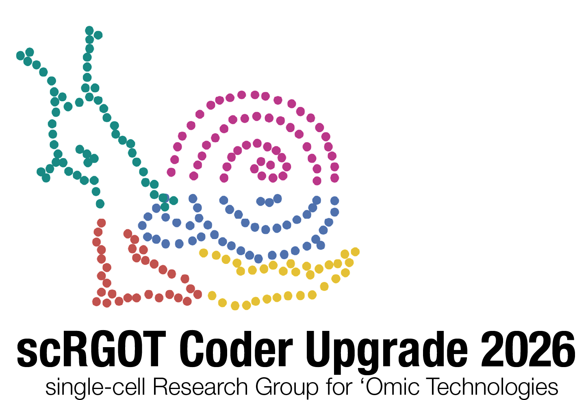

<h1 align="center">2026 Coder Upgrade</h1>

  

This repo contains materials for the Nationwide Children's Hospital 2026 Coder Upgrade, a single-cell analysis coding boot camp run by SCRGOT (the Single Cell Research Group for Omics Technologies).

## Registration
Registration for the boot camp is now open! Please visit our [registration page](https://NationwideChildrens.cloud-cme.com/SCRGOT26).

This will run from June 15th to June 18th, 2026 from 8AM to 4:30PM each day. The boot camp will be held in person at Nationwide Children's Hospital in Columbus, Ohio.

Registration fee covers all computational resources as well as breakfast and lunch each day.

## Prerequisites
This boot camp is designed for individuals with a basic understanding of single-cell biology and some experience with R programming. We will be using the Seurat package for single-cell analysis, so familiarity with R and RStudio is recommended.

If you are not comfortable working with R, please register for our free introduction to R workshop [here](https://NationwideChildrens.cloud-cme.com/IntroToR).

This workshop will run from April 20th to April 24th, 2026, and will cover the basics of R programming, including data manipulation, visualization, and basic statistical analysis.

If you want to look over the intro to R materials before the workshop, you can find them [here](https://github.com/MVesuviusC/R_workshop).

## Schedule
The boot camp will run from 9:00 AM to 4:00 PM each day, with a 1-hour lunch break from 12:00 PM to 1:00 PM. The schedule will be as follows:

| Level    | Day        | Topic                                                           |
|----------|------------|---------------------------------------------------------------- |
| Beginner | Monday     | Fundamental single-cell concepts and experimental design, Seurat|
|          | Tuesday    | Processing single-cell data and cell type annotation            |
|          | Wednesday  | Combining datasets, data integration and batch correction       |
|          | Thursday   | Differential expression analysis, GSEA and experimental design  |
| Advanced | Monday     | Understanding Seurat object structure, using public datasets    |
|          | Tuesday    | Spatial single-cell analysis                                    |
|          | Wednesday  | Cell-cell communication analysis                                |
|          | Thursday   | 10X multiomics analysis                                         |

## Materials
All materials for the boot camp will be made available on our GitHub repository [here](https://github.com/kidcancerlab/NCH_Coder_Upgrade). Within the "Sessions" folder you will find the code covered during each session. If you are working through this independently, the data used in the boot camp can be found online and downloaded using the code in the "workshop_data" folder.
