## Spatial omics: a (multi-modal) introduction

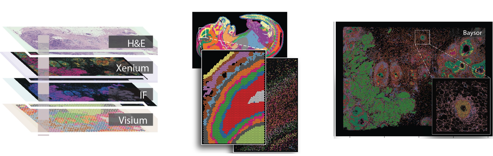

<br>

## What is spatial omics - transcriptomics?

A combination of one or more:

-   sequencing

-   imaging

-   spatial data science

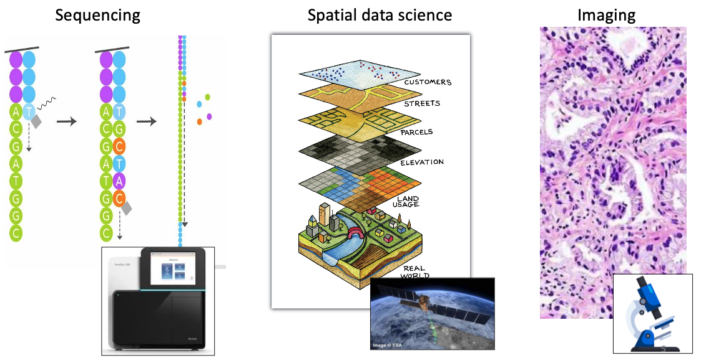

<br>

## What are the main spatial omics technologies?

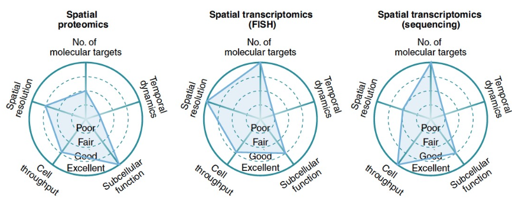

Lewis, S.M. et al. Nat Methods (2021)

<br>

## What is the conceptual difference between (sc)RNA-seq and spatial?


-   RNA-seq: old ruins

-   scRNA-seq: details about what is needed to build a house

-   spatial omics: a plan to build a house in a neighborhood in a city in a country ... (multi-scale)

<br> <br> <br>

## Dataset & technologies

### 10X Genomics paper:

<https://www.nature.com/articles/s41467-023-43458-x>

**Summary:** Here, we use single cell, spatial and in situ technologies on serial sections of an FFPE-preserved HER+ breast cancer block to explore the heterogeneity within the tumor (**Figure**). We use Chromium Single Cell Gene Expression Flex (RNA templated ligation (RTL) technology) applied to FFPE tissues (scFFPE-seq), which unlocks vast biobanks of samples while also improving sensitivity. We use Visium CytAssist to obtain whole transcriptome spatial data. Xenium provides subcellular spatial resolution, which is particularly suited for studying tumor invasion in ductal carcinoma in situ (DCIS), due to its high molecular complexity and close proximity of different cell types. Using human breast cancer cell atlas data, we selected 313 genes of interest for the targeted Xenium In Situ panel.

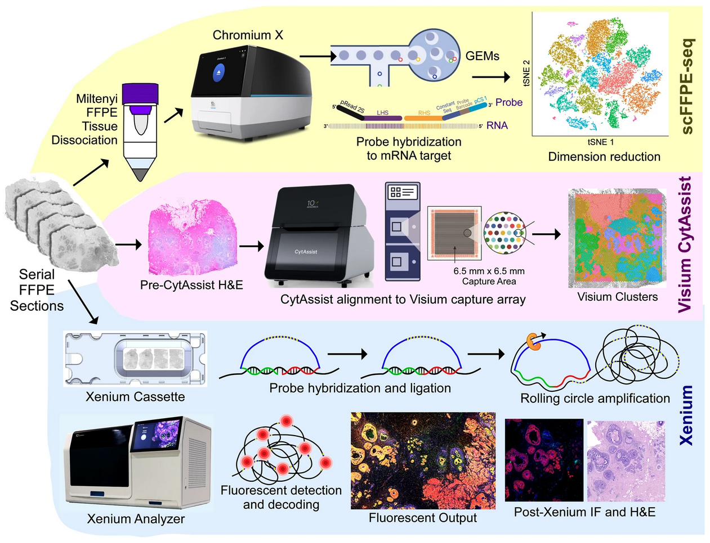

<br>

#### FRP

: Single-cell RNA-seq on FFPE tissue.

<br>

#### Immunofluorescence

: Standard (multiplex) IF to detect proteins at high resolution.

<br>

#### Visium

: Unbiased (i.e. genome-wide) spatial RNA sequencing based on spatial barcodes.


<br>

#### Xenium

: Targeted spatial subcellular RNA transcript visualization.

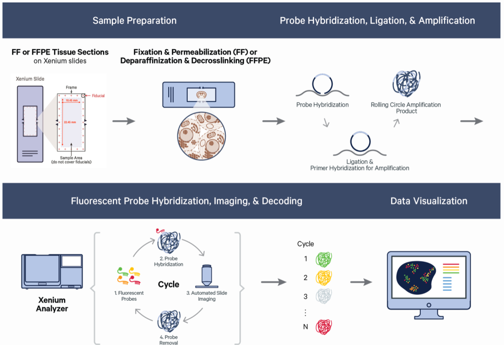

<br> <br> <br>

## Downstream analysis

**Typical data input types:**

-   expression information

-   Spatial coordinate information:

    -   spot coordinates (Visium)

    -   Cell (centroid) coordinates

    -   Transcript coordinates

    -   Polygon coordinates

-   Images of the underlying tissue

**Various spatial downstream analysis:**

-   Some are specific to certain technologies

-   using one or more of the previous data modalities:

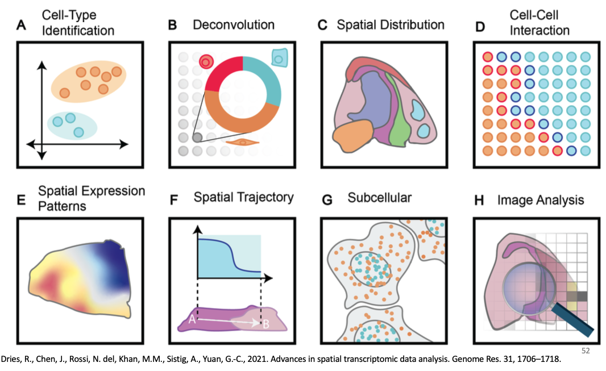

<br> <br> <br>

## Existing tools

### R

*Giotto Suite*

-   paper: <https://www.biorxiv.org/content/10.1101/2023.11.26.568752v1>

-   original: <https://genomebiology.biomedcentral.com/articles/10.1186/s13059-021-02286-2>

-   website: <http://www.giottosuite.com>

*Seurat*

-   Interoperability vignette is on its way

*Bioconductor/SpatialExperiment*

-   <https://drieslab.github.io/Giotto_website/articles/interoperability_spatialexperiment.html>

```{r, eval=FALSE}

# from giotto --> spatialExperiment
SE_object <- giottoToSpatialExperiment(giotto_object)

# do stuff in BioC

# from spatialExperiment --> giotto
new_giotto_object <- spatialExperimentToGiotto(spe = SE_object)
```

### Python

*AnnData/Squidpy*: most similar to Giotto

-   <https://drieslab.github.io/Giotto_website/articles/interoperability_anndata.html#anndata-to-giotto>

*SpatialData*: focused on spatial data storage & representation. Will be compatible with Giotto.

<br> <br> <br>

## Setup

### load libraries & install Giotto python environment

-   python environment is optional: needed for specific functions, interoperability with AnnData etc.
-   python environment will not be needed for this tutorial

```{r, message=FALSE, warning=FALSE}

# Ensure Giotto Suite is installed.
if(!"Giotto" %in% installed.packages()) {
  pak::pkg_install("drieslab/Giotto")
}

# Check whether the Python environment for Giotto has been installed.
genv_exists = Giotto::checkGiottoEnvironment()

# since it's not required for this tutorial, we will not try to install
#if(!genv_exists){
#  # The following command need only be run once to install the Giotto environment.
#  Giotto::installGiottoEnvironment()
#}

library(R.utils) # to read-in .gz files
library(dplyr) # to manipulate data.table output using tidyverse syntax if preferred

library(scran) # to identify differentially expressed genes (DEGs) for clusters
library(ComplexHeatmap) # to visualize results using a heatmap

library(quadprog) # for spatialDWLS deconvolution
library(Rfast) # for spatialDWLS deconvolution
library(scatterpie) # to visualize deconvolution results

library(Giotto)
```

### Source helper function

```{r, eval=TRUE}

# source a helper function to read in .gmt files for GSEA
read.gmt = function(filename){
  if(! file.exists(filename)) stop('File ',filename,' not available\n')
  dat = readLines(filename)
  n = length(dat)
  res = list(genesets=vector(mode = "list", length = n),
           geneset.names=vector(mode = "character", length = n),
           geneset.descriptions=vector(mode = "character", length = n))
  for(i in 1:n){
    s = strsplit(dat[i],'\t')[[1]]
    res$genesets[[i]] = s[-c(1:2)]
    res$geneset.names[i] = s[1]
    res$geneset.descriptions[i] = s[2]
  }
  names(res$genesets) = res$geneset.names
  res
}

# to write a chatGPT query
writeChatGPTquery = function(DEG_output, 
                             top_n_genes = 10, 
                             tissue_type = 'human breast cancer', 
                             folder_name = getwd(), 
                             file_name = 'chatgpt_query.txt') {
  
  chatgpt_query = paste0("Identify cell types of ", tissue_type, " tissue using the following markers. Identify one cell type for each row. Only provide the cell type name and the marker genes used for cell type identification.")
  
  selected_DEG_output = DEG_output[, head(.SD, top_n_genes), by="cluster"]
  
  finallist = list()
  finallist[[1]] = chatgpt_query
  
  for(clus in unique(selected_DEG_output$cluster)) {
    x = selected_DEG_output[cluster == clus][['feats']]
    x = c(clus, x)
    finallist[[as.numeric(clus)+1]] = x
  }
  
  outputdt = data.table::data.table(finallist)
  
  cat('\n start writing \n')
  data.table::fwrite(x = outputdt, 
                     file = paste0(folder_name,'/', file_name),
                     sep2 = c(""," ",""), col.names = F)
  
} 
```

<br> <br> <br> <br>


### Path to data directory

```{r}
source_data_path = '/Users/rubendries/Documents/Datasets/SCRGOT_data/' # SCRGOT

# source_data_path =  '/gpfs0/home1/gdworkshop/lab/Sessions/adv_wednesday/' # Franklin cluster
# source_data_path =  '/igm/projects/NCH_Coder_Upgrade/Sessions/adv_wednesday/' # IGM cluster
```

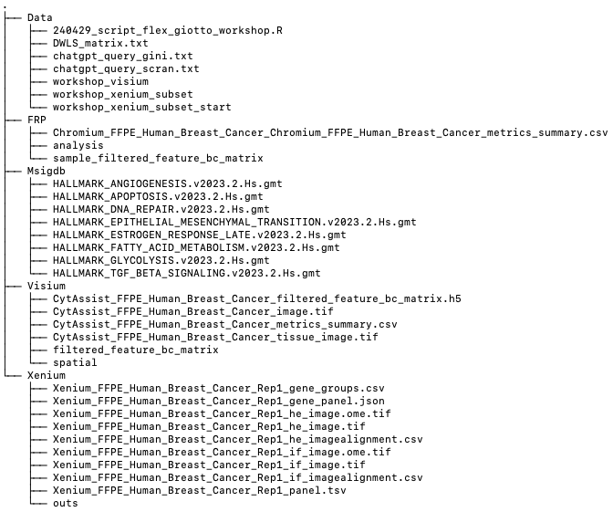

## A. Visium analysis

### Shortcut

Fully processed Giotto object is available:

```{r, eval=FALSE}
visium_BrCa = loadGiotto(path_to_folder = file.path(source_data_path, "/Data/", "workshop_visium"))
```

### Filepaths

```{r}

# visium folder where the data is saved
data_path = file.path(source_data_path, "/Visium/")

# set directory where you want to save your results (images etc)
# we will not use this, but it can significantly speed up your interactive analysis
# rendering spatial plots is often times the slowest part!
results_folder = file.path(source_data_path, "/Visium/Results/")
```

## 1. Create Giotto Visium Object and visualize

### 1.1 Create Giotto instructions

```{r}
# Optional: Specify a path to a Python executable within a conda or miniconda 
# environment. If set to NULL (default), the Python executable within the previously
# installed Giotto environment will be used.
my_python_path = NULL # alternatively, "/local/python/path/python" if desired.

# 1.1 Create Giotto Instructions
instrs = createGiottoInstructions(
    save_dir = results_folder,
    save_plot = FALSE,
    show_plot = FALSE,
    return_plot = TRUE, 
    python_path = my_python_path
)
```

### 1.2 Manual Giotto object creation

```{r, eval=TRUE}

# get data paths
# expression data path
expr_dir = file.path(data_path, "filtered_feature_bc_matrix")

# spatial data paths
spat_dir = file.path(data_path, "spatial")
xy_path = file.path(spat_dir, "tissue_positions.csv")
image_path = file.path(spat_dir, "tissue_lowres_image.png")
scalef_path = file.path(spat_dir, "scalefactors_json.json")

# read in expression matrix
exprmat = get10Xmatrix(expr_dir, gene_column_index = 2)

# read in spatial information
xy_dt = data.table::fread(xy_path)
# keep only those in tissue since we are using the filtered expression matrix
xy_dt = xy_dt[in_tissue == 1, .(barcode, pxl_col_in_fullres, pxl_row_in_fullres)]

# read in image and rescale
img = createGiottoLargeImage(image_path,
                             negative_y = FALSE)
scalef = jsonlite::read_json(scalef_path)
img@raster_object = terra::rescale(
  x = img@raster_object, 
  fx = 1/scalef$tissue_lowres_scalef, # the horizontal scaling factor
  x0 = 0, y0 = 0 # scale from coordinate origin
)
```

#### 1.2.1 Option 1: guided creation through createGiottoObject

```{r, eval=FALSE}
# create giotto object with essential information
visium_BrCa_manual = createGiottoObject(
  expression = exprmat,
  spatial_locs = xy_dt,
  largeImages = list(img),
  instructions = instrs
)

# add additional layer of Visium polygons (spots with correct dimensions)
visium_BrCa_manual = addVisiumPolygons(
  visium_BrCa_manual, 
  scalefactor_path = scalef_path
)
```

#### 1.2.2 Option 2: piece-wise

Create an empty `giotto` object and then add in whichever pieces of data that are desired.

```{r, eval=FALSE}
# create empty object. Add our instructions (optional)
visium_BrCa_manual2 = giotto(instructions = instrs)

# expression info
exprObj = GiottoClass::createExprObj(
  expression_data = exprmat,
  name = "raw",
  spat_unit = "cell",
  feat_type = "rna"
)

# spatial info
spatlocs = GiottoClass::createSpatLocsObj(
  coordinates = xy_dt,
  name = "raw",
  spat_unit = "cell"
)

# manual way of creating visium polys
spot_poly = GiottoClass::circleVertices(radius = scalef$spot_diameter_fullres/2,
                                        npoints = 50)
vis_spots_dt = polyStamp(
   stamp_dt = spot_poly, spatlocs = xy_dt, 
             id_col = "barcode",
             x_col = "pxl_col_in_fullres", 
             y_col = "pxl_row_in_fullres"
)
vis_poly = createGiottoPolygon(vis_spots_dt, calc_centroids = TRUE)
plot(vis_poly)

# set values
visium_BrCa_manual2 <- setGiotto(gobject = visium_BrCa_manual2, 
                                 x = exprObj)
visium_BrCa_manual2 <- setGiotto(gobject = visium_BrCa_manual2, 
                                 x = spatlocs)
visium_BrCa_manual2 <- setGiotto(gobject = visium_BrCa_manual2,
                                 x = vis_poly)

visium_BrCa_manual2 <- addGiottoLargeImage(gobject = visium_BrCa_manual2, 
                                           largeImages = list(img))
```

### 1.3 Option 3: convenience function that loads data directly from Visium folder

```{r, eval=TRUE}
visium_BrCa = createGiottoVisiumObject(visium_dir = data_path,
                                       expr_data = 'filter',
                                       png_name = 'tissue_lowres_image.png',
                                       gene_column_index = 2,
                                       instructions = instrs)
```

### 1.4 inspect the Giotto object

#### 1.4.1 show associated images with giotto object

```{r}
showGiottoImageNames(visium_BrCa) # "image" is the default name
```

#### 1.4.2 check cell / spot metadata

```{r}
pDataDT(visium_BrCa)
getCellMetadata(visium_BrCa)
```

#### 1.4.3 check feature / gene

```{r}
fDataDT(visium_BrCa)
getFeatureMetadata(visium_BrCa)
```

#### 1.4.4 show plot

```{r}

# each data slot is associated with a spatial unit (spat_unit) and feature type (feat_type), however this is only relevant for multi-modal/omics/scale data, see section C [Next steps].

# each spot has a unique ID = 'cell_ID'
spatPlot2D(gobject = visium_BrCa, 
           spat_unit = 'cell', # default
           feat_type = 'rna',  # default
           cell_color = 'cell_ID', 
           point_size = 1.5,
           show_image = TRUE, 
           largeImage_name = 'image', 
           show_legend = F,
           show_plot = TRUE)
```

<br> <br>

## 2. Process Giotto Visium Object

### 2.1 subset on spots that were covered by tissue

#### visualize tissue and spots information

```{r}
spatPlot2D(gobject = visium_BrCa, 
           cell_color = 'in_tissue', 
           point_size = 1.5,
           cell_color_code = c('0' = 'lightgrey', '1' = 'blue'), 
           show_image = TRUE, 
           largeImage_name = 'image',
           show_plot = TRUE)
```

#### obtain spot/cell IDs that are 'in_tissue'

```{r}

# data.table way
metadata = pDataDT(visium_BrCa)
in_tissue_barcodes = metadata[in_tissue == 1]$cell_ID

# tidyverse way
metadata_tbl = dplyr::as_tibble(metadata)
in_tissue_barcodes_tbl = dplyr::filter(metadata_tbl, in_tissue == 1)$cell_ID

identical(in_tissue_barcodes, in_tissue_barcodes_tbl)

# no need to subset for this example since all spots are 'in_tissue'
# visium_BrCa = subsetGiotto(visium_BrCa, 
#                            cell_ids = in_tissue_barcodes)
```

### 2.2 filter

-   remove spots/cells that have very few reads.
-   can be dangerous with spatial datasets.
-   Alternative 1: data imputation (not covered here)
-   Alternative 2: tagging of cells & features (not covered here)

```{r}
showGiottoExpression(visium_BrCa)
visium_BrCa <- filterGiotto(gobject = visium_BrCa,
                            expression_threshold = 1,
                            feat_det_in_min_cells = 50,
                            min_det_feats_per_cell = 500,
                            expression_values = c('raw'),
                            verbose = TRUE)
```

### 2.3 normalize for library depth and create scaled expression matrix

-   various normalization strategies (data analysis requires some work)
-   including normalization according to cell area (2D estimate!)

```{r}
# default is similar to single-cell (library size, log-transformation, scaling)
visium_BrCa <- normalizeGiotto(gobject = visium_BrCa, 
                               scalefactor = 6000, 
                               verbose = TRUE)
```

### 2.4 add gene & cell statistics

```{r}
visium_BrCa <- addStatistics(gobject = visium_BrCa)
```

### 2.5 visualize

```{r}
# use alpha to better visualize the underlying image
spatPlot2D(
    gobject = visium_BrCa, 
    show_image = TRUE, 
    largeImage_name = 'image',
    point_size = 1.5,
    point_alpha = 0.8,
    cell_color = 'nr_feats', 
    color_as_factor = FALSE,
    show_plot = TRUE)

spatPlot2D(
    gobject = visium_BrCa, 
    show_image = TRUE, 
    largeImage_name = 'image',
    point_size = 1.5,
    point_alpha = 0.4,
    cell_color = 'nr_feats', 
    color_as_factor = FALSE,
    show_plot = TRUE)
```

<br> <br>

## 3. Dimension Reduction

### 3.1 highly variable features / genes (HVF)

-   in expression bins (default)
-   loess regression
-   pearson residuals

```{r}
visium_BrCa <- calculateHVF(gobject = visium_BrCa, 
                             save_plot = TRUE)

fDataDT(visium_BrCa) # results will be added to the feature metadata for default workflow
```

### 3.2 run PCA on the highly variable genes

```{r}
# get highly variable genes from gene metadata and filter them further
gene_metadata = fDataDT(visium_BrCa)
featgenes = gene_metadata[hvf == 'yes' & perc_cells > 4 & mean_expr_det > 0.5]$feat_ID

gene_metadata_tbl = dplyr::as_tibble(gene_metadata)
featgenes_tbl = dplyr::filter(gene_metadata_tbl, hvf == 'yes' & perc_cells > 4 & mean_expr_det > 0.5)$feat_ID

identical(featgenes, featgenes_tbl)

# run pca
visium_BrCa <- runPCA(gobject = visium_BrCa,
                      feats_to_use = featgenes)

# run screePlot to visualize the contribution of each PC to the total variance
screePlot(visium_BrCa, 
          ncp = 30,
          show_plot = TRUE)
```

### 3.3 visualize

```{r}
dimPlot2D(gobject = visium_BrCa,
          dim_reduction_to_use = "pca",
          show_plot = TRUE)

plotPCA(gobject = visium_BrCa,
        show_plot = TRUE)
```

### 3.4 run UMAP on PCA space (default)

```{r}
visium_BrCa <- runUMAP(visium_BrCa, 
                       dimensions_to_use = 1:20)

plotUMAP(gobject = visium_BrCa,
         show_plot = TRUE)

showGiottoDimRed(visium_BrCa)
```

<br> <br>

## 4. Clustering

### 4.1 sNN network visium_BrCa

```{r}
visium_BrCa <- createNearestNetwork(gobject = visium_BrCa, 
                                     dimensions_to_use = 1:20, 
                                     k = 15)
showGiottoNearestNetworks(visium_BrCa)
```

### 4.2 Leiden clustering

```{r}
visium_BrCa <- doLeidenClusterIgraph(gobject = visium_BrCa, 
                                     resolution = 0.2, 
                                     n_iterations = 1000)
pDataDT(visium_BrCa)
```

### 4.3 visualize

```{r}
plotUMAP(gobject = visium_BrCa,
         cell_color = 'leiden_clus', 
         point_size = 1.5,
         show_plot = TRUE)

plotUMAP(gobject = visium_BrCa,
         cell_color = 'leiden_clus', 
         show_NN_network = T, 
         point_size = 1.5,
         show_plot = TRUE)
```

```{r}
# spatial plots 
spatPlot2D(visium_BrCa, 
           cell_color = 'leiden_clus',
           point_size = 1,
           coord_fix_ratio = 1,
           show_plot = TRUE)

# spatial plot with image
spatPlot2D(visium_BrCa, 
           cell_color = 'leiden_clus',
           point_size = 1.5,
           show_image = TRUE, 
           largeImage_name = 'image',
           point_alpha = 0.5,
           coord_fix_ratio = 1,
           show_plot = TRUE)

```

```{r}
# spatial and dimension plots together
spatDimPlot(gobject = visium_BrCa, 
            cell_color = 'leiden_clus',
            dim_point_size = 1, 
            spat_point_size = 1,
            show_plot = TRUE)

spatDimPlot(gobject = visium_BrCa, 
            cell_color = 'nr_feats', 
            color_as_factor = F,
            dim_point_size = 1, 
            spat_point_size = 1,
            show_plot = TRUE)

```

```{r}
# spatial plots grouped by cluster
spatPlot2D(visium_BrCa, 
           cell_color = 'leiden_clus',
           group_by = 'leiden_clus', 
           coord_fix_ratio = 0.5,
           cow_n_col = 5, 
           show_legend = F,
           point_size = 1,
           show_plot = TRUE)

# visualize one specific cluster
spatPlot2D(visium_BrCa, 
           cell_color = 'leiden_clus',
           select_cell_groups = '3', 
           coord_fix_ratio = 1, 
           show_other_cells = TRUE,
           cell_color_code = c('3' = 'red'),
           point_size = 1.5,
           other_cell_color = "grey", 
           other_point_size = 0.5,
           show_plot = TRUE)

# visualize one specific cluster
spatPlot2D(visium_BrCa, 
           cell_color = 'leiden_clus',
           select_cell_groups = '3', 
           coord_fix_ratio = 1, 
           show_other_cells = TRUE,
           cell_color_code = c('3' = 'red'),
           point_size = 1.5,
           other_cell_color = "grey", 
           other_point_size = 0.5,
           show_image = TRUE, 
           largeImage_name = 'image',
           point_alpha = 0.5,
           show_plot = TRUE)
```

<br> <br>

## 5. Data exploration

### 5.1 Interactive shiny app

-   Will not be run today. See <https://drieslab.github.io/Giotto_website/articles/interactive_selection.html> for more details.


### 5.2 Data subsettting

-   using cell/spot IDs (e.g. obtained from interactive selection)
-   using coordinates

```{r}
# create and visualize subset
visium_BrCa_subset = subsetGiottoLocs(visium_BrCa,
                                      x_max = 9000, x_min = 6000,
                                      y_max = -5500, y_min = -8500,
                                      return_gobject = TRUE)

spatDimPlot(gobject = visium_BrCa_subset,
            cell_color = 'leiden_clus', 
            spat_point_size = 2,
            show_plot = TRUE)

spatPlot2D(visium_BrCa_subset, 
           cell_color = 'leiden_clus',
           show_image = TRUE, 
           largeImage_name = 'image',
           point_alpha = 0.5, 
           point_size = 5,
           coord_fix_ratio = 1,
           show_plot = TRUE)
```

<br> <br>

## 6. marker gene detection for clusters

-   scran (sensitive)
-   gini (specific)
-   MAST (sensitive and specific, but slow)

### 6.1 Scran Markers

```{r, eval=TRUE, warning=FALSE, message=FALSE}
scran_markers = findMarkers_one_vs_all(gobject = visium_BrCa,
                                       method = 'scran',
                                       expression_values = 'normalized',
                                       cluster_column = 'leiden_clus')

# cluster heatmap
heatmap_scran_genes = scran_markers[, head(.SD, 5), by = 'cluster']$feats
plotMetaDataHeatmap(visium_BrCa, 
                    selected_feats = heatmap_scran_genes,
                    metadata_cols = c('leiden_clus'), 
                    y_text_size = 6)
```

### 6.2 Gini markers

```{r, eval=TRUE, warning=FALSE, message=FALSE}
gini_markers = findMarkers_one_vs_all(gobject = visium_BrCa,
                                      method = 'gini',
                                      expression_values = 'normalized',
                                      cluster_column = 'leiden_clus',
                                      min_feats = 20,
                                      min_expr_gini_score = 0.5,
                                      min_det_gini_score = 0.5)

# cluster heatmap
heatmap_gini_genes = gini_markers[, head(.SD, 5), by = 'cluster']$feats
plotMetaDataHeatmap(visium_BrCa, 
                    selected_feats = heatmap_gini_genes,
                    metadata_cols = c('leiden_clus'), 
                    y_text_size = 6)
```

<br> <br>

## 7. Gene set enrichment

### 7.1 gene sets retrieved from Msigdb

```{r, eval=TRUE, warning=FALSE, message=FALSE}
angiogenesis = read.gmt(file.path(source_data_path, '/Msigdb/HALLMARK_ANGIOGENESIS.v2023.2.Hs.gmt')) 
angiogenesis_genes = angiogenesis$genesets$HALLMARK_ANGIOGENESIS

fatty = read.gmt(file.path(source_data_path, '/Msigdb/HALLMARK_FATTY_ACID_METABOLISM.v2023.2.Hs.gmt'))
fatty_genes = fatty$genesets$HALLMARK_FATTY_ACID_METABOLISM

TGFb = read.gmt(file.path(source_data_path, '/Msigdb/HALLMARK_TGF_BETA_SIGNALING.v2023.2.Hs.gmt'))
TGFb_genes = TGFb$genesets$HALLMARK_TGF_BETA_SIGNALING

apoptosis = read.gmt(file.path(source_data_path, '/Msigdb/HALLMARK_APOPTOSIS.v2023.2.Hs.gmt'))
apoptosis_genes = apoptosis$genesets$HALLMARK_APOPTOSIS

EMT = read.gmt(file.path(source_data_path, '/Msigdb/HALLMARK_EPITHELIAL_MESENCHYMAL_TRANSITION.v2023.2.Hs.gmt'))
EMT_genes = EMT$genesets$HALLMARK_EPITHELIAL_MESENCHYMAL_TRANSITION

estrogen = read.gmt(file.path(source_data_path,'/Msigdb/HALLMARK_ESTROGEN_RESPONSE_LATE.v2023.2.Hs.gmt'))
estrogen_genes = estrogen$genesets$HALLMARK_ESTROGEN_RESPONSE_LATE
```

### 7.2 create signature matrix for different gene sets and run PAGE enrichment algo

-   PAGE: parametric analysis of Gene Set Enrichment
-   see <https://doi.org/10.1186/1471-2105-6-144> for more info
-   RANK is an alternative enrichment algo

```{r}
PAGE_matrix = makeSignMatrixPAGE(sign_names = c('angiogenesis',
                                                'fatty_acid_metabolism',
                                                'TGFbeta',
                                                'apoptosis',
                                                'EMT',
                                                'estrogen'),
                                 sign_list = list(angiogenesis_genes,
                                                  fatty_genes,
                                                  TGFb_genes,
                                                  apoptosis_genes, 
                                                  EMT_genes, 
                                                  estrogen_genes))

visium_BrCa <- runPAGEEnrich(gobject = visium_BrCa, 
                              sign_matrix = PAGE_matrix)

showGiottoSpatEnrichments(visium_BrCa)
```

### 7.3 visualizations

```{r}
names_PAGE = colnames(PAGE_matrix)
plotMetaDataCellsHeatmap(gobject = visium_BrCa,
                         metadata_cols = 'leiden_clus',
                         value_cols = names_PAGE,
                         spat_enr_names = 'PAGE',
                         x_text_size = 8,
                         y_text_size = 8,
                         show_plot = TRUE)

spatCellPlot2D(gobject = visium_BrCa,
               spat_enr_names = 'PAGE',
               cell_annotation_values = names_PAGE[1:2],
               cow_n_col = 2,
               coord_fix_ratio = 1, 
               point_size = 1, 
               show_legend = T,
               show_plot = TRUE)

spatCellPlot2D(gobject = visium_BrCa,
               spat_enr_names = 'PAGE',
               cell_annotation_values = names_PAGE[3:4],
               cow_n_col = 2,
               coord_fix_ratio = 1, 
               point_size = 1, 
               show_legend = T,
               show_plot = TRUE)

spatCellPlot2D(gobject = visium_BrCa,
               spat_enr_names = 'PAGE',
               cell_annotation_values = names_PAGE[5:6],
               cow_n_col = 2,
               coord_fix_ratio = 1, 
               point_size = 1, 
               show_legend = T,
               show_plot = TRUE)
```

<br> <br>

## 8. spatial network

-   essential for many spatial downstream analyses
-   encodes the spatial information between spatial units (e.g. spots or cells)

```{r}
# create and visualize spatial network
visium_BrCa <- createSpatialNetwork(gobject = visium_BrCa,
                                     method = 'kNN', 
                                     k = 5,
                                     maximum_distance_knn = 400,
                                     name = 'spatial_network')

showGiottoSpatNetworks(visium_BrCa)

spatPlot2D(gobject = visium_BrCa,  
           show_network= T,
           network_color = 'red', 
           point_size = 1,
           spatial_network_name = 'spatial_network',
           show_plot = TRUE)
```

<br> <br>

## 9. Spatial Genes

-   classic spatial statistics (e.g. Moran's I)

 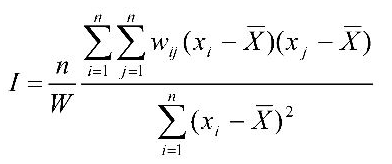

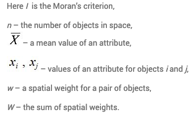

-   Moran's I is slow for many genes, alternatives?
-   binSpect: Binary Spatial Extraction of genes
    -   fast with enough memory
    -   good first screening tool

```{r}
showGiottoSpatNetworks(visium_BrCa)


# subset on genes with high COV z-score to speed up the algo
hvf_genes <- calculateHVF(gobject = visium_BrCa, 
                          return_plot = F, 
                          return_gobject = FALSE)
top_variable_genes = hvf_genes[cov_group_zscore > 1][['feats']]


## rank binarization
ranktest = binSpect(visium_BrCa, 
                    subset_feats = top_variable_genes, 
                    bin_method = 'rank',
                    spatial_network_name = 'spatial_network')

## visualize
spatFeatPlot2D(visium_BrCa, 
               expression_values = 'scaled',
               feats = ranktest$feats[1:2], 
               cow_n_col = 2, 
               point_size = 1,
               show_plot = TRUE)

spatFeatPlot2D(visium_BrCa, 
               expression_values = 'scaled',
               feats = ranktest$feats[3:4], 
               cow_n_col = 2, 
               point_size = 1,
               show_plot = TRUE)
```

<br> <br>

## 10. Spatial Co-Expression modules

How to find recurring or robust spatial expression patterns?

### 10.1 select spatial variable genes

-   number
-   significance cut-off

```{r}
ext_spatial_genes = ranktest[1:1000,]$feats
```

### 10.2 calculate spatial correlations based on existing spatial network

```{r}
# calculate pairwise distances between genes
# set network_smoothing = 0 to use default clustering
spat_cor_netw_DT = detectSpatialCorFeats(visium_BrCa,
                                         method = 'network',
                                         spatial_network_name = 'spatial_network',
                                         subset_feats = ext_spatial_genes)
```

### 10.3 identify most similar spatially correlated genes for one gene

```{r}
top10_genes = showSpatialCorFeats(spat_cor_netw_DT, 
                                  feats = 'CDH1', 
                                  show_top_feats = 10)

# visualize genes
spatFeatPlot2D(visium_BrCa, 
               expression_values = 'scaled',
               feats = top10_genes$variable[1:4], 
               point_size = 1,
               show_plot = TRUE)
```

### 10.4 perform unbiased hierarchical clustering on spatial co-expression genes

```{r}
spat_cor_netw_DT = clusterSpatialCorFeats(spat_cor_netw_DT, 
                                          name = 'spat_netw_clus', 
                                          k = 12)
# visualize clusters
heatmSpatialCorFeats(visium_BrCa,
                     spatCorObject = spat_cor_netw_DT,
                     use_clus_name = 'spat_netw_clus',
                     heatmap_legend_param = list(title = NULL),
                     show_plot = TRUE)
```

### 10.5 create metagene enrichment score for clusters

```{r}
cluster_genes_DT = showSpatialCorFeats(spat_cor_netw_DT, 
                                       use_clus_name = 'spat_netw_clus', 
                                       show_top_feats = 1)

cluster_genes = cluster_genes_DT$clus 
names(cluster_genes) = cluster_genes_DT$feat_ID

visium_BrCa <- createMetafeats(visium_BrCa, 
                               feat_clusters = cluster_genes, 
                               name = 'cluster_metagene')

# visualize metagenes
spatCellPlot(visium_BrCa,
             spat_enr_names = 'cluster_metagene',
             cell_annotation_values = as.character(1:4),
             point_size = 0.75, 
             cow_n_col = 2,
             show_plot = TRUE)

spatCellPlot(visium_BrCa,
             spat_enr_names = 'cluster_metagene',
             cell_annotation_values = as.character(5:8),
             point_size = 0.75, 
             cow_n_col = 2,
             show_plot = TRUE)

spatCellPlot(visium_BrCa,
             spat_enr_names = 'cluster_metagene',
             cell_annotation_values = as.character(9:12),
             point_size = 0.75, 
             cow_n_col = 2,
             show_plot = TRUE)
```

A possible next step would be to perform GSEA on these modules.

-   Which processes are spatially organized?

-   What's the role of cell type distribution?

<br> <br>

## 11. Spatially informed clusters

```{r, eval=TRUE}
# top 30 genes per spatial co-expression cluster
my_spatial_genes = getBalancedSpatCoexpressionFeats(spatCorObject = spat_cor_netw_DT, 
                                                    maximum = 30)

# dimension reduction with a set of genes representing spatial patterns
visium_BrCa <- runPCA(gobject = visium_BrCa,
                       feats_to_use = names(my_spatial_genes),
                       name = 'custom_pca')

visium_BrCa <- runUMAP(visium_BrCa, 
                        dim_reduction_name = 'custom_pca', 
                        dimensions_to_use = 1:20,
                        name = 'custom_umap')

# cluster
visium_BrCa <- createNearestNetwork(gobject = visium_BrCa,
                                     dim_reduction_name = 'custom_pca',
                                     dimensions_to_use = 1:20, 
                                     k = 15,
                                     name = 'custom_NN')

visium_BrCa <- doLeidenClusterIgraph(gobject = visium_BrCa, 
                                     network_name = 'custom_NN',
                                     resolution = 0.25, 
                                     n_iterations = 1000,
                                     name = 'custom_leiden')

cell_meta = pDataDT(visium_BrCa)
cell_clusters = unique(cell_meta$custom_leiden)

selected_colors = getDistinctColors(length(cell_clusters))
names(selected_colors) = cell_clusters

spatPlot2D(visium_BrCa, 
           cell_color = 'custom_leiden', 
           cell_color_code = selected_colors, 
           point_size = 1.5,
           coord_fix_ratio = 1,
           show_plot = TRUE)

spatPlot2D(visium_BrCa, 
           cell_color = 'leiden_clus', 
           point_size = 1.5,
           coord_fix_ratio = 1,
           show_plot = TRUE)
```

<br> <br>

## 12. Spatial deconvolution

Paper: "SpatialDWLS: accurate deconvolution of spatial transcriptomic data" <https://doi.org/10.1186/s13059-021-02362-7>

**!! It takes \~10min to run this section on a Mac with 16Gb RAM !!**

```{r, eval=TRUE}
# matrix made from FRP / scRNA-seq data
DWLS_matrix = read.table(file.path(source_data_path, '/Data/', 'DWLS_matrix.txt'))
```

```{r, eval=FALSE}
# spatialDWLS deconvolution approach
visium_BrCa <- runDWLSDeconv(gobject = visium_BrCa, 
                              sign_matrix = DWLS_matrix)

```

Let's use our shortcut: a giotto visium object with pre-computed deconvolution results:

```{r, eval=TRUE}
visium_BrCa = loadGiotto(path_to_folder = file.path(source_data_path, '/Data/', 'workshop_visium'))
```

```{r}
# Plot DWLS deconvolution result
spatCellPlot2D(gobject = visium_BrCa,
               spat_enr_names = 'DWLS',
               cell_annotation_values = colnames(DWLS_matrix)[1:4],
               cow_n_col = 2,
               coord_fix_ratio = 1, 
               point_size = 0.75)

spatCellPlot2D(gobject = visium_BrCa,
               spat_enr_names = 'DWLS',
               cell_annotation_values = colnames(DWLS_matrix)[5:8],
               cow_n_col = 2,
               coord_fix_ratio = 1, 
               point_size = 0.75)

spatCellPlot2D(gobject = visium_BrCa,
               spat_enr_names = 'DWLS',
               cell_annotation_values = colnames(DWLS_matrix)[9:10],
               cow_n_col = 2,
               coord_fix_ratio = 1, 
               point_size = 0.75)

# Plot DWLS deconvolution result with Pie plots
my_colors = c('brown', 'pink', 'orange', 'red',
              'blue', 'lightgreen', 'darkgray', 'yellow',
              'lightgray', 'purple')
names(my_colors) = colnames(DWLS_matrix)

spatDeconvPlot(visium_BrCa, 
               show_image = TRUE,
               largeImage_name = 'image',
               cell_color_code = my_colors,
               radius = 75)

# show 
visium_BrCa_subset = subsetGiottoLocs(visium_BrCa,
                                      x_max = 9000, x_min = 6000,
                                      y_max = -5500, y_min = -8500,
                                      return_gobject = TRUE)

spatDeconvPlot(visium_BrCa_subset, 
               show_image = TRUE,
               largeImage_name = 'image',
               cell_color_code = my_colors,
               radius = 75)
```

<br> <br>

## 13. Save and load giotto objects

See <https://drieslab.github.io/Giotto_website/articles/saving_object.html> for more details.

```{r, eval=FALSE}
saveGiotto(gobject = visium_BrCa,
           dir = file.path(source_data_path, '/Data/',
           foldername = 'workshop_visium')

visium_BrCa_reload = loadGiotto(path_to_folder = file.path(source_data_path, '/Data/', 'workshop_visium'))

# remake last plot
spatDeconvPlot(visium_BrCa_reload, 
               show_image = TRUE,
               largeImage_name = 'image',
               cell_color_code = my_colors,
               radius = 75)
```

<br> <br> <br> <br>

## B. Xenium analysis

### Filepaths

```{r, eval=FALSE}
# Xenium folder where the data is saved
data_path = file.path(source_data_path, "/Xenium/outs/")

# set directory where you want to save your results (images etc)
# we will not use this, but it can significantly speed up your interactive analysis
# rendering spatial plots is often times the slowest part!
results_folder = file.path(source_data_path, "/Xenium/Results/")
```

<br> <br>

## 1. Create Giotto Xenium Object and visualize

### 1.1 Convenience function for Xenium output

```{r, eval=FALSE}
my_python_path = NULL # alternatively, "/local/python/path/python" if desired.

# 1.1 Create Giotto Instructions
instrs = createGiottoInstructions(
    save_dir = results_folder,
    save_plot = FALSE,
    show_plot = FALSE,
    return_plot = TRUE,
    python_path = my_python_path
)

xenium_BrCa = createGiottoXeniumObject(xenium_dir = data_path,
                                       data_to_use = 'subcellular',
                                       bounds_to_load = c('cell', 'nucleus'),
                                       qv_threshold = 20,
                                       h5_expression = F,
                                       instructions = instrs,
                                       cores = 8) # set number of cores to use

```

### 1.2 inspect the Giotto object

```{r, eval=FALSE}

# raw spatial information
# cell and nucleus polygons
showGiottoSpatialInfo(xenium_BrCa)

# spatial location information
# centroids for cell and nucleus polygons
showGiottoSpatLocs(xenium_BrCa)

# raw feature information
# transcripts but also other probes (negative or blanks)
showGiottoFeatInfo(xenium_BrCa)

spatPlot2D(xenium_BrCa,
           spat_unit = 'cell',
           point_shape = 'no_border',
           point_size = 0.25,
           point_alpha = 0.4, 
           show_plot = TRUE)

# no expression data is available, we started from the raw data and
# have not loaded the matrix
showGiottoExpression(xenium_BrCa)

```


<br> <br>

## 2. Process Giotto Xenium Object

### 2.1 create and visualize a subset for this tutorial

```{r, eval=FALSE}
xenium_BrCa_subset = subsetGiottoLocs(xenium_BrCa,
                                      x_min = 5000, x_max = 7000,
                                      y_min = 3000, y_max = 5000,
                                      return_gobject = TRUE)

saveGiotto(gobject = xenium_BrCa_subset,
           dir = file.path(source_data_path, '/Data/'),
           foldername = 'workshop_xenium_subset_start')
```

Let's use our shortcut:

```{r, eval=TRUE}
xenium_BrCa_subset = loadGiotto(path_to_folder = file.path(source_data_path, '/Data/', 'workshop_xenium_subset_start'))
```

```{r}
spatPlot2D(xenium_BrCa_subset,
           spat_unit = 'cell',
           point_shape = 'no_border',
           point_size = 0.25,
           point_alpha = 0.4,
           show_plot = TRUE)
```

### 2.2 calculate overlaps between transcripts and polygons

```{r}
# spatial overlap
xenium_BrCa_subset = calculateOverlapRaster(xenium_BrCa_subset,
                                            spatial_info = 'cell',
                                            feat_info = 'rna')

# convert results into a typical gene by cell matrix
xenium_BrCa_subset = overlapToMatrix(xenium_BrCa_subset,
                                     poly_info = 'cell',
                                     feat_info = 'rna',
                                     name = 'raw')

showGiottoExpression(xenium_BrCa_subset)
```

### 2.3 standard processing steps

```{r}
# filter 'zero-'cells
xenium_BrCa_subset = filterGiotto(gobject = xenium_BrCa_subset,
                           spat_unit = 'cell',
                           poly_info = 'cell',
                           expression_threshold = 1,
                           feat_det_in_min_cells = 3,
                           min_det_feats_per_cell = 5)

# add gene and cell statistics
xenium_BrCa_subset = addStatistics(xenium_BrCa_subset, expression_values = 'raw')

# normalize data
xenium_BrCa_subset = normalizeGiotto(gobject = xenium_BrCa_subset,
                                     spat_unit = 'cell', 
                                     scalefactor = 5000,
                                     verbose = FALSE)

# dimension reduction:
# use all genes since there are only ~300 genes
xenium_BrCa_subset = runPCA(gobject = xenium_BrCa_subset,
                            spat_unit = 'cell',
                            expression_values = 'scaled',
                            feats_to_use = NULL, # setting to NULL will select all genes
                            scale_unit = F,
                            center = F)

# Visualize Screeplot and PCA
screePlot(xenium_BrCa_subset,
          ncp = 20,
          show_plot = TRUE)

plotPCA(xenium_BrCa_subset,
        spat_unit = 'cell',
        dim_reduction_name = 'pca',
        dim1_to_use = 1,
        dim2_to_use = 2,
        show_plot = TRUE)

# umap and visualize
xenium_BrCa_subset = runUMAP(xenium_BrCa_subset,
                             dimensions_to_use = 1:10,
                             spat_unit = 'cell', 
                             n_threads = 8)

plotUMAP(xenium_BrCa_subset,
         point_size = 0.01,
         show_plot = TRUE)

# cluster cells
xenium_BrCa_subset = createNearestNetwork(xenium_BrCa_subset,
                                          dimensions_to_use = 1:10,
                                          k = 10,
                                          spat_unit = 'cell')

xenium_BrCa_subset = doLeidenClusterIgraph(xenium_BrCa_subset,
                                           resolution = 0.15,
                                           n_iterations = 100,
                                           spat_unit = 'cell')

# visualize cluster results

# on umap
plotUMAP(gobject = xenium_BrCa_subset,
         spat_unit = 'cell',
         cell_color = 'leiden_clus',
         show_legend = FALSE,
         point_size = 0.01,
         point_shape = 'no_border', 
         show_plot = TRUE)

# on spatial plot
spatPlot2D(gobject = xenium_BrCa_subset,
           spat_unit = 'cell',
           cell_color = 'leiden_clus',
           point_size = 0.1,
           point_shape = 'no_border',
           background_color = 'black',
           show_legend = TRUE,
           show_plot = TRUE)

# on spatial in situ plot
spatInSituPlotPoints(xenium_BrCa_subset,
                     show_image = FALSE,
                     feats = NULL,
                     point_size = 0.05,
                     show_polygon = TRUE,
                     polygon_feat_type = 'cell',
                     polygon_alpha = 1,
                     polygon_color = 'black',
                     polygon_line_size = 0.01,
                     polygon_fill = 'leiden_clus',
                     polygon_fill_as_factor = TRUE,
                     coord_fix_ratio = TRUE,
                     show_plot = TRUE)

```

<br> <br>

## 3. Assign cell types

### 3.1. Identify cluster marker genes

```{r}
# Scran Markers
scran_markers = findMarkers_one_vs_all(gobject = xenium_BrCa_subset,
                                       method = 'scran',
                                       expression_values = 'normalized',
                                       cluster_column = 'leiden_clus')

# cluster heatmap
heatmap_scran_genes = scran_markers[, head(.SD, 5), by = 'cluster']$feats
plotMetaDataHeatmap(xenium_BrCa_subset, 
                    selected_feats = heatmap_scran_genes,
                    metadata_cols = c('leiden_clus'), y_text_size = 6)


## Gini markers
gini_markers = findMarkers_one_vs_all(gobject = xenium_BrCa_subset,
                                      method = 'gini',
                                      expression_values = 'normalized',
                                      cluster_column = 'leiden_clus',
                                      min_feats = 20,
                                      min_expr_gini_score = 0.5,
                                      min_det_gini_score = 0.5)

# cluster heatmap
heatmap_gini_genes = gini_markers[, head(.SD, 5), by = 'cluster']$feats
plotMetaDataHeatmap(xenium_BrCa_subset, 
                    selected_feats = heatmap_gini_genes,
                    metadata_cols = c('leiden_clus'), y_text_size = 6)

```

### 3.2. create a query for ChatGPT / LLM

-   chat with chatGPT and check results!

```{r, eval=FALSE}

writeChatGPTquery(DEG_output = scran_markers, 
                  top_n_genes = 10, 
                  tissue_type = 'human breast cancer', 
                  folder_name = file.path(source_data_path, '/Data/'),
                  file_name = 'chatgpt_query_scran.txt')

writeChatGPTquery(DEG_output = gini_markers, 
                  top_n_genes = 10, 
                  tissue_type = 'human breast cancer', 
                  folder_name = file.path(source_data_path, '/Data/'),
                  file_name = 'chatgpt_query_gini.txt')

```

### 3.3. assign cell types to clusters

```{r}
## create vector with names following the cluster names
clusters_cell_types = c('CAFs', 'Macrophage_M2', 'naive_Tcells', 'Lum_BrCa_cells_1',
                        'Myoepithelial', 'DCs', 'Cytotoxic_Tcells', 'Lum_BrCa_cells_2',
                        'Endothelial_cells', 'Bas_BrCa_cells', 'B_cells', 'Plasma_cells')
names(clusters_cell_types) = 1:12

xenium_BrCa_subset = annotateGiotto(gobject = xenium_BrCa_subset, 
                             annotation_vector = clusters_cell_types,
                             cluster_column = 'leiden_clus', 
                             name = 'cell_types')

plotUMAP(gobject = xenium_BrCa_subset,
         cell_color = 'cell_types', 
         point_size = 1, 
         show_plot = TRUE)

spatInSituPlotPoints(xenium_BrCa_subset,
                     show_image = FALSE,
                     feats = NULL,
                     point_size = 0.05,
                     show_polygon = TRUE,
                     polygon_feat_type = 'cell',
                     polygon_alpha = 1,
                     polygon_color = 'black',
                     polygon_line_size = 0.01,
                     polygon_fill = 'cell_types',
                     polygon_fill_as_factor = TRUE,
                     coord_fix_ratio = TRUE,
                     show_plot = TRUE)

```

### 3.4 additional visualizations

```{r}

# visualize select cell types
cell_type_names = as.character(clusters_cell_types)
custom_colors = rep('lightgray', length(cell_type_names))
names(custom_colors) = cell_type_names

custom_colors[['B_cells']] = 'red'
custom_colors[['naive_Tcells']] = 'orange'
custom_colors[['Myoepithelial']] = 'blue'

spatInSituPlotPoints(xenium_BrCa_subset,
                     show_image = FALSE,
                     feats = NULL,
                     point_size = 0.05,
                     show_polygon = TRUE,
                     polygon_feat_type = 'cell',
                     polygon_alpha = 1,
                     polygon_color = 'black',
                     polygon_line_size = 0.01,
                     polygon_fill = 'cell_types', 
                     polygon_fill_code = custom_colors,
                     polygon_fill_as_factor = TRUE,
                     coord_fix_ratio = TRUE,
                     show_plot = TRUE)


# visualize transcripts with/without cell type annotations

# plot all transcripts
spatInSituPlotPoints(xenium_BrCa_subset,
                     show_image = FALSE,
                     feats = list(rna = c('CD8A', 'KRT23', 'KRT14',
                                          'MZB1', 'VWF', 'MS4A1')),
                     point_size = 0.3,
                     use_overlap = FALSE,
                     show_polygon = TRUE,
                     polygon_feat_type = 'cell',
                     polygon_alpha = 1,
                     polygon_color = 'black',
                     polygon_line_size = 0.01,
                     polygon_fill = NULL, 
                     polygon_fill_as_factor = TRUE,
                     coord_fix_ratio = TRUE, 
                     plot_last = 'points',
                     show_plot = TRUE) # what to plot last, points or polygons?

# plot only transcripts that were assigned to a cell
spatInSituPlotPoints(xenium_BrCa_subset,
                     show_image = FALSE,
                     feats = list(rna = c('CD8A', 'KRT23', 'KRT14',
                                          'MZB1', 'VWF', 'MS4A1')),
                     point_size = 0.3,
                     use_overlap = TRUE,
                     show_polygon = TRUE,
                     polygon_feat_type = 'cell',
                     polygon_alpha = 1,
                     polygon_color = 'black',
                     polygon_line_size = 0.01,
                     polygon_fill = NULL, 
                     polygon_fill_as_factor = TRUE,
                     coord_fix_ratio = TRUE, 
                     plot_last = 'points',
                     show_plot = TRUE) # what to plot last, points or polygons?

```

<br> <br>

## 4. Spatial analyses at the single-cell level

### 4.1 create spatial network

```{r}
# create spatial network
xenium_BrCa_subset <- createSpatialNetwork(gobject = xenium_BrCa_subset, 
                                           maximum_distance_delaunay = 500)
showGiottoSpatNetworks(xenium_BrCa_subset)

spatPlot2D(gobject = xenium_BrCa_subset,  
           show_network= TRUE,
           network_color = 'red', 
           network_alpha = 0.5,
           point_size = 0.5,
           show_plot = TRUE)
```

Zoom: 

### 4.2 cell type proximity enrichment

-   which cell types are typically in each other's neighborhood?
-   depends on tissue region
-   depends on spatial network (bigger or smaller neighborhoods)

```{r}
cell_proximities = cellProximityEnrichment(gobject = xenium_BrCa_subset,
                                           cluster_column = 'cell_types',
                                           adjust_method = 'fdr',
                                           number_of_simulations = 1000)
## barplot
cellProximityBarplot(gobject = xenium_BrCa_subset,
                     CPscore = cell_proximities, 
                     min_orig_ints = 5, min_sim_ints = 5,
                     show_plot = TRUE)

## heatmap
cellProximityHeatmap(gobject = xenium_BrCa_subset, 
                     CPscore = cell_proximities, 
                     order_cell_types = T, scale = T,
                     color_breaks = c(-1.5, 0, 1.5), 
                     color_names = c('blue', 'white', 'red'),
                     show_plot = TRUE)

```

Visualize two cell types:

```{r}
cell_type_names = as.character(clusters_cell_types)
custom_colors = rep('lightgray', length(cell_type_names))
names(custom_colors) = cell_type_names

custom_colors[['B_cells']] = 'red'
custom_colors[['Plasma_cells']] = 'green'

spatInSituPlotPoints(xenium_BrCa_subset,
                     show_image = FALSE,
                     feats = NULL,
                     point_size = 0.05,
                     show_polygon = TRUE,
                     polygon_feat_type = 'cell',
                     polygon_alpha = 1,
                     polygon_color = 'black',
                     polygon_line_size = 0.01,
                     polygon_fill = 'cell_types', 
                     polygon_fill_code = custom_colors,
                     polygon_fill_as_factor = TRUE,
                     coord_fix_ratio = TRUE,
                     show_plot = TRUE)

```

### 4.3 cell type niche clustering

```{r}
showGiottoSpatNetworks(xenium_BrCa_subset)
xenium_BrCa_subset <- calculateSpatCellMetadataProportions(gobject = xenium_BrCa_subset,
                                                           spat_network = 'Delaunay_network',
                                                           metadata_column = "cell_types",
                                                           name = "cell_type_niche",
                                                           return_gobject = TRUE)

# These enrichments are essentially a measure of how many cells of each
# cell type exist in the local region
prop_table = getSpatialEnrichment(gobject = xenium_BrCa_subset, 
                                  name = 'cell_type_niche', 
                                  output = 'data.table')

# convert the data.table to a sparse Matrix with row and colnames
# here we use a utility function to perform the operation
prop_matrix = GiottoUtils::dt_to_matrix(prop_table)


# Using kmeans, we can classify each cell by its niche leiden cluster proportions
set.seed(12345) # set seed for kmeans
prop_kmeans = kmeans(x = prop_matrix, centers = 10, iter.max = 500, nstart = 5)
prop_kmeansDT = data.table::data.table(
  cell_ID = names(prop_kmeans$cluster), 
  niche = prop_kmeans$cluster
)

# add kmeans clustering of niches to cell metadata
xenium_BrCa_subset <- addCellMetadata(gobject = xenium_BrCa_subset, 
                                      new_metadata = prop_kmeansDT, 
                                      by_column = TRUE,
                                      column_cell_ID = "cell_ID")

spatInSituPlotPoints(gobject = xenium_BrCa_subset, 
                     polygon_fill = "cell_types", 
                     polygon_fill_as_factor = TRUE,
                     polygon_line_size = 0.01,
                     polygon_alpha = 1,
                     show_plot = TRUE)

spatInSituPlotPoints(gobject = xenium_BrCa_subset, 
                     polygon_fill = "niche", 
                     polygon_fill_as_factor = TRUE,
                     polygon_line_size = 0.01,
                     polygon_alpha = 1,
                     show_plot = TRUE)

```

What's the composition of the niches?

```{r}

# get cell metadata
cell_meta = pDataDT(xenium_BrCa_subset)

# calculate percentage of cell types for each niche
niche_cell_type = cell_meta[, .N, by = .(niche, cell_types)]
data.table::setorder(niche_cell_type, niche)
niche_cell_type[, perc := (N/sum(N))*100, by = .(niche)]

# barplot showing the cell-type composition of each niche 
pl = ggplot()
pl = pl + geom_bar(data = niche_cell_type, aes(x = as.factor(niche), 
                                               fill = cell_types, 
                                               y = perc), stat = 'identity')
pl = pl + theme_classic()
pl


```

<br> <br>

## 5. Save and load giotto objects

See <https://drieslab.github.io/Giotto_website/articles/saving_object.html> for more details.

```{r, eval=FALSE}
saveGiotto(gobject = xenium_BrCa_subset,
           dir = file.path(source_data_path, '/Data/'),
           foldername = 'workshop_xenium_subset_end')

xenium_BrCa_subset_reload = loadGiotto(path_to_folder = file.path(source_data_path, '/Data/', 'workshop_xenium_subset_end'))
```

<br> <br> <br> <br>

## C. Next steps

-   Combining spatial technologies / datasets with our Giotto Suite framework!

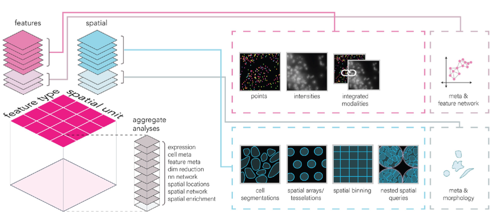

-   Big data analysis!
    -   flexible tiling approaching

    -   data projection approaches

    -   database backend
-   R/Spatial data science

<https://r-spatial.org/book/>


<br> <br>

#### 1. Giotto Suite paper

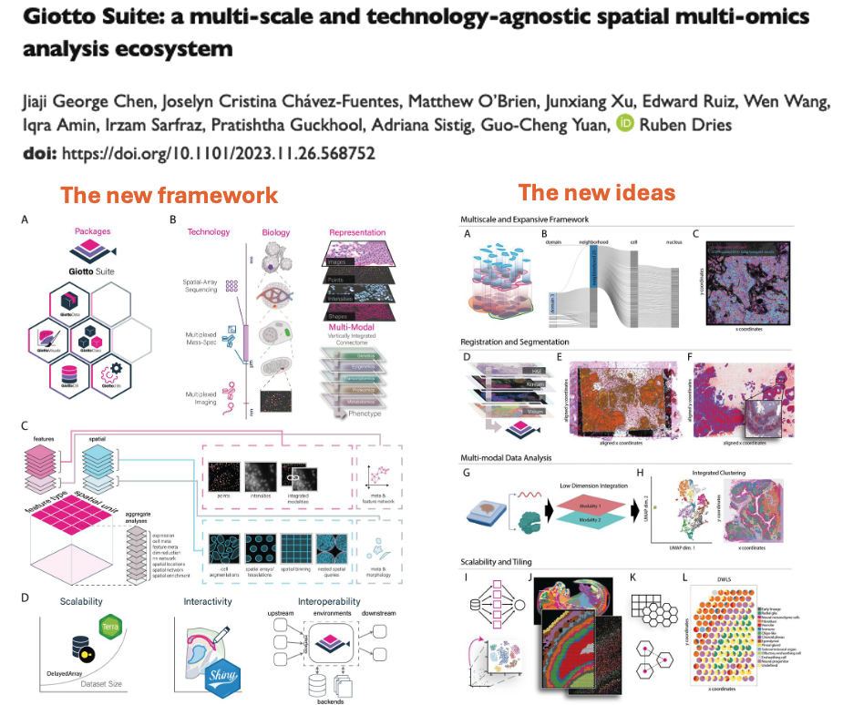

<br> <br>

#### 2. Website / Github / Slack

Giotto website: www.giottosuite.com

Github repo: for bugs and discussions: <https://github.com/drieslab/Giotto>

Slack: join our channel if you want to contribute. see https://drieslab.github.io/Giotto_website/CONTRIBUTING.html for more details.

<br> <br>

#### 3. extended Giotto workshop

-   Date: August 5 - 7
-   Format: remote & free
-   intro / essential / advanced topics


<br> <br> <br> <br>

## Session Info

```{r}
sessionInfo()
```
